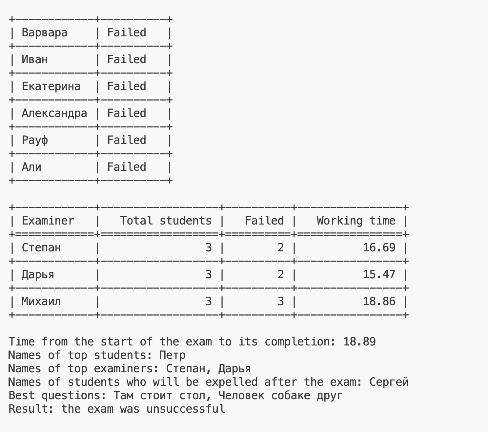

# Multithreaded Exam Simulation

## Описание

Этот проект представляет собой симуляцию экзамена, где каждый экзаменатор работает в отдельном потоке. Студенты проходят экзамен, и в конце выводится отчет о количестве студентов, количестве неудачных экзаменов, времени работы каждого экзаменатора и общая информация о результатах экзамена.

## Структура проекта

- `data/`: Директория, содержащая исходные данные для симуляции.
    - `examiners.txt`: Список экзаменаторов.
    - `questions.txt`: Список вопросов для экзамена.
    - `students.txt`: Список студентов, проходящих экзамен.
- `src/`: Директория с исходным кодом проекта.
    - `main.py`: Главный исполняемый файл для запуска симуляции экзамена.
    - `update_data_functions.py`: Модуль с функциями для обновления и обработки данных.
    - `print_functions.py`: Модуль с функциями для вывода информации на экран.
    - `thread_functions.py`: Модуль с функциями для работы с потоками, имитирующими экзаменаторов.
